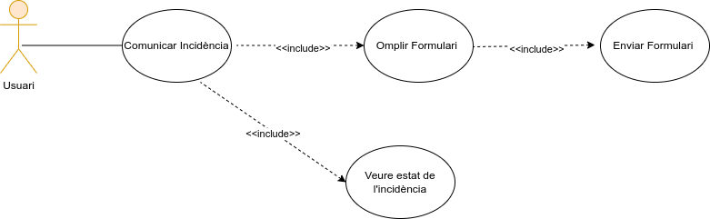
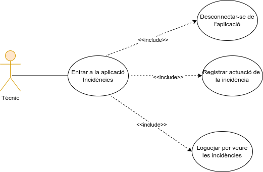
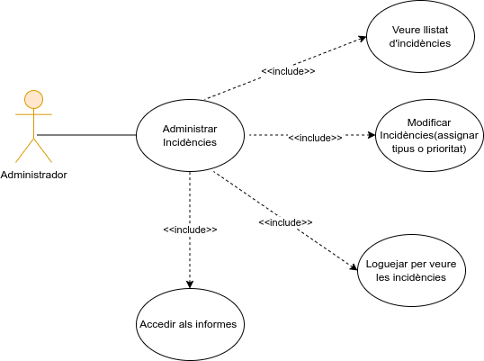

<h1 align="center"> Bones som el grup de Alvaro y Bryan</h1>
<h3 align="center">Formem part del GRUP 10</h3>

Aquest es el disseny del projecte en l'apartat de github  
  

<i>Esperem que us agradi!</i> 🚀
 
 
 

	

Diagrames del projecte 

     
 
  <strong>Diagrames casos d'ús</strong>

	    
  

    <h3>Diagrama Usuari</h3>
    
    
  
  

  

  

    <h3>Diagrama Tecnic</h3>
    
  

  

  

    <h3>Diagrama Administrador</h3>
    
  

    

 
 
 
 
 
 
 

Fes click aquí sobre ,per veure l'historial del projecte

     

<strong>22/04/2025</strong>   

En aquest dia creem el Taiga i el grup en el repositori de github també creem el disseny de tot el github per tenir una bona presentacio dels diagrames

    

 <strong>23/04/2025</strong>   

 Vam crear els diagrames de casos d'us i els vaig pujar al github i començem l'esquema de pantalles (wireframe) 
    

 <strong>24/04/2025</strong>   

 Treballem el el model E-R y conceptual de la base de dades del usuaris tècnics,administrador acabem l'esquema de pantalles de les incidències 
    

 <strong>25/04/2025</strong>   

 Convertim el model E-Rconceptual de la base de dades a model Relacional (Creació de taules a la base de dades) i planifiquem el Sprint 1 que farem la setmana vinent
    

 
 
 
 
 
 
 
 
 
 
 
 

<h3>Enllanços per trobar més informació sobre el projecte</h3>

 
 

 

<h3>Aplicacions utilitzades per al projecte </h3> 

 
     
     
     
    
     
       

